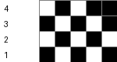
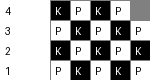

# Информация на счет формата хранения схем для вышивания
На просторах интернета, как рускоязычные запросы, так и англоязычные выдавали примерно одинаковую информацию.
Одной унифицированной библиотеки или чего-то подобного нет, но есть грубое описание реализации подобного через двумерный
массив и библиотеку Pillow для визуализации. 
Данная функция показывает базовую обработку паттерна для шитья, а также визуализирует её.  
## Пример с простымя стяжками
```python
pattern = [
    [0, 1, 0, 1, 1],
    [1, 0, 1, 0, 1],
    [0, 1, 0, 1, 0],
    [1, 0, 1, 0, 1]
]
```
  
## Пример с усложненными элементами
```python
pattern_with_stitches = [
    ['K', 'P', 'K', 'P', 'a'],
    ['P', 'K', 'P', 'K', 'P'],
    ['K', 'P', 'K', 'P', 'K'],
    ['P', 'K', 'P', 'K', 'P']
]
```

# Итог
Идею данной функции можно обернуть в отдельный класс для масштабирования возможностей работы с паттернами, а также модифицировать для
соответствия стандартам заполнения схем для шитья.